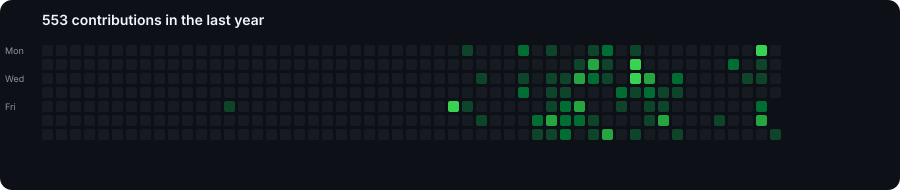
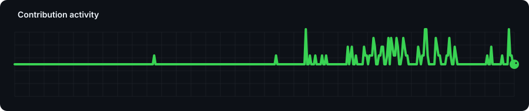

<div align="center">

# Hi, I'm Patrick 👋

### Student · Software Developer · Java Enthusiast

🇩🇪 Germany · ☕ Java · 🐧 Linux · 🐳 Docker

<br>

**Creating software people actually want to use.**

<br>

[](https://github.com/WinniePatGG)
[](mailto:winniepat@proton.me)

</div>

---

## 👨‍💻 About Me

I'm Patrick, a student and software developer interested in building **useful, maintainable software** and learning how things work from the code all the way down to the server.

I'm particularly interested in **Java**, backend development, and self-hosted infrastructure. I enjoy working with Linux servers, Docker-based environments, and the tools that make deploying and maintaining software easier.

My current goal is simple:

> **Create software people want to use.**

Outside of programming, I enjoy **swimming** and **traveling**. 🌍

---

## 🛠️ Technologies

### Languages


### Development


### Infrastructure


---

## 💻 Tools

| Tool              | Why I use it                    |
| ----------------- | ------------------------------- |
| **IntelliJ IDEA** | Java development                |
| **VS Code**       | General development & scripting |
| **Termius**       | Managing remote servers         |

---

## 📈 GitHub Activity

<div align="center">



</div>


## 🐍 Contribution Snake

<div align="center">



</div>

---

## 🎯 Current Focus

```text
Building useful software
        ↓
Improving my development skills
        ↓
Learning more about backend & infrastructure
        ↓
Building things people actually want to use
```

I'm continuously working on becoming a better developer by combining **software development with practical infrastructure knowledge**.

---

## 🌍 Beyond Code

When I'm not coding, you'll probably find me:

🏊 **Swimming**

✈️ **Traveling**

🐧 **Exploring Linux & self-hosting**

☕ **Experimenting with Java**

---

## 📫 Let's Connect

<div align="center">

<a href="mailto:winniepat@proton.me">
  
</a>

<a href="https://github.com/WinniePatGG">
  
</a>

</div>

<br>

<div align="center">

### Thanks for visiting! 👋

*Always learning. Always building.*

</div>
