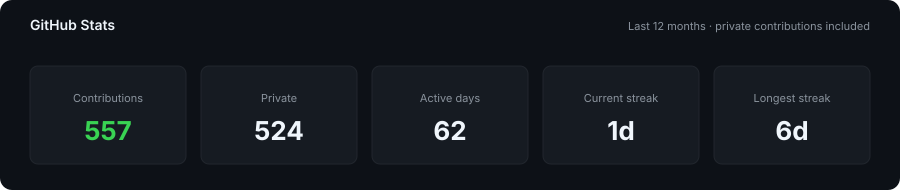

# Hi, I'm Patrick 👋

🇩🇪 Germany · ☕ Java · 🐧 Linux · 🐳 Docker

 

**Creating software people actually want to use.**

 

---

## 👨‍💻 About Me

I'm Patrick, a student and software developer who likes building **useful, maintainable software** and understanding how it works all the way from the code down to the server it runs on.

Most of my work lives somewhere around **Java and backend development** - from Discord bots and web services to a whole ecosystem of **Minecraft plugins** - plus the occasional detour into Python, TypeScript, Kotlin, and Rust. I care about software that is simple to run, easy to maintain, and actually solves someone's problem.

My current goal is simple:

> **Create software people want to use.**

Outside of programming, I enjoy **swimming** and **traveling**. 🌍

---

## 📈 GitHub Activity

 

---

## 🛠️ Technologies

### Languages

### Frameworks & Runtimes

### Infrastructure

---

## 💻 Tools

| Tool              | Why I use it                    |
| ----------------- | ------------------------------- |
| **IntelliJ IDEA** | Java development                |
| **VS Code**       | General development & scripting |
| **Termius**       | Managing remote servers         |

---

## 🌍 Beyond Code

When I'm not coding, you'll probably find me:

🏊 **Swimming**

✈️ **Traveling**

🐧 **Exploring Linux & self-hosting**

☕ **Experimenting with Java**

---

## 📫 Let's Connect

 

### Thanks for visiting! 👋

*Always learning. Always building.*

